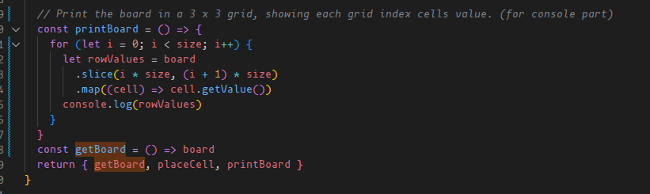
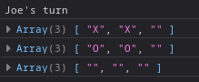
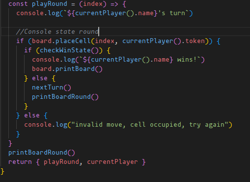
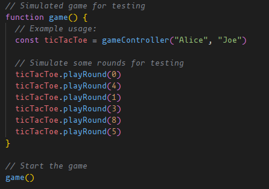

# Tic Tac Toe

## A simple game, made in practice using factory functions and module patterns

[The Odin Tic Tac Toe project](https://www.theodinproject.com/lessons/node-path-javascript-tic-tac-toe) is a project made as an exercise to hammer in the good patterns taught during the [factory functions and module pattern](https://www.theodinproject.com/lessons/node-path-javascript-factory-functions-and-the-module-pattern#encapsulating-with-the-module-pattern) segment of the curriculum. It's an exciting introduction to good and solid programming patterns that result in readable, functional, and safe code practices.

## The exercise

#### A thing to keep in mind is an important detail.

The main goal of the project is to end up using as little global code as possible, tucking as much of the program into factories, with only a single instance or something, like the gameboard, display controller ETC, exposed in global scope, to be wrapped into a IIFE module pattern so it cannot be used to create additional instances.

The exercise is a practice in thinking before coding. It's not just about creating an end-result that works, but creating one that is solid, and follows good practice in it's execution.

#### The exercise is two-fold

Start by creating the game to be fully functional in the console, without thinking about the UI aspect at all. Creating a solid functional foundation independent of the UI ensures the visual features will be able to function with as little influence on the program as possible.

Once the game is working in console, a seperate object should handle displaying the game, and handling the DOM logic. Creating functionality to allow players to add Xs and Os to the UI, having it communicate with the script behind the scenes.

### The console parts

#### For the sake of documentation

As the game receives it's UI makeover, all the console exclusive parts will be commented out or removed entirely. So for the sake of documentation, here is how I tested the game in the console stage:

#### How does it work?

During the creation of the gameboard factory, I added a method to create a 3x3 grid based on the arrays size, and display their cell values in console:

It does the following:

<ol>
<li> Itterate through each row of the gameboard </li>
<li> slice a portion of the board array, depending on the size of the array, and cuts it into subarray rows</li>
<li>Map each cell in the row to it's current value using getValue from the cell object.</li>
<li>Print the array of cell values to console, displaying each arrays indexes cell value.</li>
<li>The printBoard method is then exposed and used in relevant functions and methods further on</li>
</ol>

result:

Now, in order to test the running of the game, I used a console version of playRound

The process is pretty straightfoward.

<ol>
<li>The method accepts an index for the round, and announces the current players turn.</li>
<li>We check if the cell is occupied already, if so we go straight to a log stating a invalid dmove</li>
<li>We then check if the move resulted in a win condition(the win conditions were kept for the UI portion and wont be covered)</li>
<li>If no win condition was found, show the board and start a new round.</li>
</ol>

Finally, I simulated some moves invoking the game controller with two player names, and play some rounds.
I basically simulate the inputs that will be made by the UI later on.

